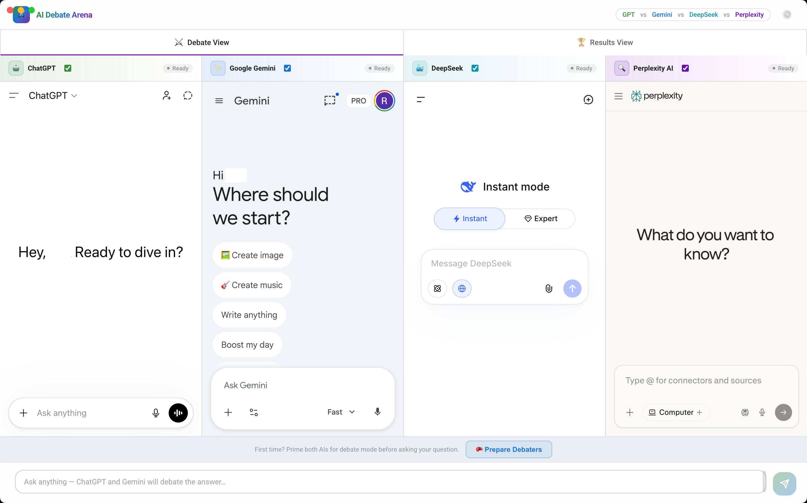
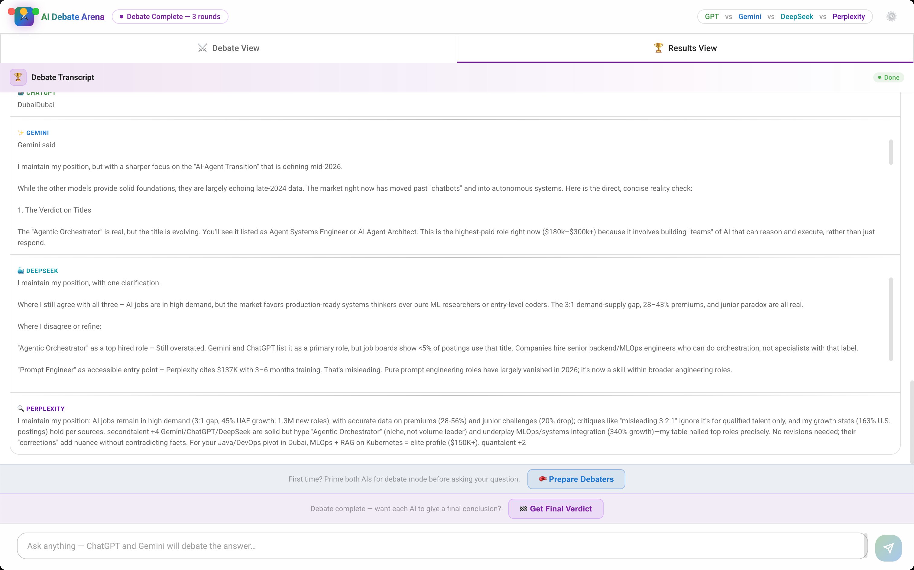

# ⚔️ AI Debate Arena

<p align="center">
  <strong>An automated, multi-round debate platform where ChatGPT, Google Gemini, DeepSeek, and Perplexity AI face off in real-time.</strong>
</p>

<p align="center">
  <a href="https://github.com/thakur-raj/ai-debate-arena/blob/main/LICENSE">
    
  </a>
  <a href="https://github.com/thakur-raj/ai-debate-arena/stargazers">
    
  </a>
  <a href="https://github.com/thakur-raj/ai-debate-arena/forks">
    
  </a>
  <a href="https://github.com/thakur-raj/ai-debate-arena/issues">
    
  </a>
  <a href="https://github.com/thakur-raj/ai-debate-arena/pulls">
    
  </a>
</p>

<p align="center">
  
  <br/>
  <em>Main interface showing debate panels for ChatGPT, Gemini, DeepSeek, and Perplexity AI</em>
</p>

<p align="center">
  
  <br/>
  <em>Results view showing debate transcript and conclusion panel</em>
</p>

## 🌟 Overview

**AI Debate Arena** is an Electron-based application that embeds ChatGPT, Google Gemini, DeepSeek, and Perplexity AI into isolated webviews and orchestrates automated multi-AI debates. You simply provide a topic or question, select the number of rounds, configure your debate settings, and the application acts as the moderator—feeding each AI's response to the others as counter-arguments.

## ✨ Key Features

- **🤖 Multi-AI Debate Platform:** Configure debates between ChatGPT, Google Gemini, DeepSeek, and Perplexity AI with up to 10 rounds of back-and-forth discussion.
- **🔄 Automated Cross-Sharing:** The application's orchestrator automatically extracts arguments from one AI and feeds them as counter-prompts to the others without manual intervention.
- **🥊 Prepare Debaters Mode:** Prime all AIs for a concise, punchy debate mode before starting, ensuring high-quality, brief arguments tailored to the debate setting.
- **⚙️ Advanced Configuration:** 
  - **Custom Message Delays:** Tweak the delay between messages to account for network speed and AI response times.
  - **Response Detail Modes:** Control the verbosity and format of the AIs' responses.
- **🏁 Final Verdict & Conclusion Phase:** Once the debate rounds conclude, the platform requests a structured final verdict from all AIs summarizing their definitive positions.
- **🏆 Judge the Winner:** Review the beautifully formatted debate transcript with stabilized scrolling, and cast your vote for the AI that made the most compelling case in the interactive Conclusion Panel.
- **🔒 Secure & Persistent Sessions:** Uses robust session management with isolated Electron webview partitions (`persist:chatgpt`, `persist:gemini`, `persist:deepseek`) to safely persist your login sessions without interfering with your main browser. 

## 🚀 Getting Started

### Download Prebuilt Binaries (Windows/macOS/Linux)

Grab the latest release from the [Releases page](https://github.com/thakur-raj/ai-debate-arena/releases) — no Node.js or source build needed.

| Platform | File |
|---|---|
| Windows | `AI Debate Arena Setup 1.0.0.exe` (installer) or `AI Debate Arena-1.0.0-win32-x64.zip` (portable) |
| macOS (Intel) | `AI Debate Arena-1.0.0-x64.dmg` |
| macOS (Apple Silicon) | `AI Debate Arena-1.0.0-arm64.dmg` |
| Linux | `AI Debate Arena-1.0.0.AppImage` |

**macOS:** After downloading, open the `.dmg` and drag the app to Applications. Then run this in Terminal:

```bash
xattr -cr /Applications/AI\ Debate\ Arena.app
```

Now launch from Launchpad or Spotlight. This is needed because the app isn't signed with an Apple Developer account ($99/year). The app is safe and open-source.

**Windows:** May show a SmartScreen warning because the installer is not code-signed ($99+/year). Click **"More info" → "Run anyway"** to proceed. The app is safe and open-source.

### Prerequisites

- [Node.js](https://nodejs.org/) (v16 or higher recommended) — only needed if running from source
- Standard accounts for ChatGPT, Google Gemini, DeepSeek, and/or Perplexity AI (you will need to log into them inside the app).

### Installation (from source)

1. **Clone the repository:**
   ```bash
   git clone https://github.com/thakur-raj/ai-debate-arena.git
   cd ai-debate-arena
   ```

2. **Install dependencies:**
   ```bash
   npm install
   ```

3. **Start the application (Development Mode):**
   ```bash
   npm run dev
   ```

### First Run & Login
When you open the app for the first time, the webviews for ChatGPT, Gemini, DeepSeek, and Perplexity AI will prompt you to log in.
1. Log into ChatGPT on its respective panel.
2. Log into Google Gemini on its respective panel.
3. Log into DeepSeek on its respective panel.
4. Log into Perplexity AI on its respective panel (if using).
5. Once logged in, your sessions are saved automatically across restarts!

## 🛠️ Tech Stack & Architecture

- **Desktop Framework:** [Electron](https://www.electronjs.org/) (Handles webview isolation and cross-origin orchestration)
- **Frontend Framework:** [React 18](https://react.dev/) + [Vite](https://vitejs.dev/)
- **Styling:** Vanilla CSS with a custom Glassmorphism design system and modern UI tokens.
- **Orchestration Logic:** A robust custom React hook (`useDebateOrchestrator`) manages the complex state machine of the debate (priming, rounds, waiting for responses, concluding).
- **DOM Injection:** Custom JavaScript injectors (`chatgptInjector.js`, `geminiInjector.js`, `deepseekInjector.js`, `perplexityInjector.js`) are safely executed within the webviews to read AI responses and simulate user input.

### Core Architecture Components
- **`useDebateOrchestrator.js`**: The brains of the operation. Manages the debate state machine, orchestrates the turns, and handles the handoff between the AI models.
- **`WebviewPanel.jsx`**: A reusable component that safely wraps Electron's `<webview>` tags, handling events like `dom-ready` and IPC messages to eliminate rendering errors.
- **`ConclusionPanel.jsx`**: The final phase UI where users can review the summarized arguments and cast their vote for the winner.
- **`SettingsModal.jsx`**: A comprehensive configuration system allowing users to fine-tune the orchestrator's timing and behavior.

## 💡 How to Use

1. **Configure Settings:** Click the settings icon to open the Settings modal. Here you can tweak message delays and response detail modes to your liking.
2. **Prime the AIs:** Click the **🥊 Prepare Debaters** button at the bottom before your first debate to instruct the AIs to keep their answers short and punchy.
3. **Set Rounds:** Choose the number of debate rounds (1-10) in the input bar.
4. **Start the Debate:** Type your question or topic and hit **Send**.
5. **Watch it Unfold:** The app will handle the rest, capturing responses and passing them back and forth. The transcript will automatically scroll to keep you up to date.
6. **Get Final Verdict:** After the rounds are done, the conclusion phase can be triggered to show their final concluding statements.
7. **Vote:** Cast your vote for the winner in the final Conclusion Panel!

## 📊 Graphify Knowledge Graph

This project uses [graphify](https://github.com/trae/graphify) to maintain a knowledge graph of the codebase, which helps with understanding architecture and answering codebase questions.

### Setting Up Graphify

1. **Activate the Python virtual environment:**
   ```bash
   source venv/bin/activate  # On macOS/Linux
   # or
   .\venv\Scripts\activate   # On Windows
   ```

2. **Install graphify (if not already installed):**
   ```bash
   pip install graphifyy
   ```

### Creating and Updating the Graph

1. **Generate the initial knowledge graph:**
   ```bash
   graphify update .
   ```

2. **Update the graph after code changes:**
   ```bash
   graphify update .  # AST-only, no API cost
   ```

### Using the Graph

- **Browse the generated documentation:** Open `graphify-out/wiki/index.md` (if it exists) for a navigable wiki-style documentation
- **Review the graph report:** Check `graphify-out/GRAPH_REPORT.md` for god nodes and community structure analysis
- **Explore the interactive graph:** Open `graphify-out/graph.html` in a browser to visualize the codebase relationships

### Rules for Contributors
- Before answering architecture or codebase questions, read `graphify-out/GRAPH_REPORT.md` for god nodes and community structure
- If `graphify-out/wiki/index.md` exists, navigate it instead of reading raw files
- After modifying code files, run `graphify update .` to keep the graph current

## 🔧 Troubleshooting & Clearing Cache

Because this application relies on reading the DOM of third-party web apps (ChatGPT, Gemini, DeepSeek), it is sensitive to UI changes on those platforms. 

### Quick Restart & Cleanup
If you see a blank screen or the app is hanging, run this cleanup command in your terminal to kill stale processes and restart:

**Mac/Linux:**
```bash
pkill -f "electron ." 2>/dev/null; pkill -f "vite" 2>/dev/null; lsof -ti:5173,5174,5175 | xargs kill -9 2>/dev/null; sleep 1 && npm run dev
```

### Full Cache Clear
If you need to completely reset the Vite cache or Electron state:
```bash
rm -rf node_modules/.vite
npm run dev
```

*Note: The app spoofs a standard Chrome User-Agent at the Electron session level to prevent AI platforms from blocking the webviews.*

## 🤝 Contributing

Contributions, issues, and feature requests are welcome! 

**Important note for contributors:** Since this project relies on DOM selectors (`document.querySelector`) to interact with external platforms, it *will* break if ChatGPT, Gemini, DeepSeek, or Perplexity AI update their UI. PRs to update broken selectors in `src/utils/*Injector.js` files are highly appreciated and are the most common maintenance tasks for this project.

1. Fork the Project
2. Create your Feature Branch (`git checkout -b feature/AmazingFeature`)
3. Commit your Changes (`git commit -m 'Add some AmazingFeature'`)
4. Push to the Branch (`git push origin feature/AmazingFeature`)
5. Open a Pull Request

## ⚠️ Legal & Safety Disclaimer

**CRITICAL WARNING: This software may violate Terms of Service of AI platforms and could result in account termination.**

### 🚨 Important Legal Notice

This is an independent, open-source educational project designed for research and learning purposes only.

#### No Affiliation or Endorsement
- This project is **NOT** affiliated with, endorsed by, or sponsored by:
  - **OpenAI** (ChatGPT)
  - **Google** (Gemini)
  - **DeepSeek AI**
  - **Perplexity AI**
- All trademarks, service marks, and logos are property of their respective owners.

#### Terms of Service Violations
This application uses **DOM scraping and browser automation** to interact with AI platforms, which may explicitly violate their Terms of Service:

| Platform | Potential ToS Violations |
|----------|--------------------------|
| **ChatGPT (OpenAI)** | Automated access, scraping, bypassing rate limits |
| **Google Gemini** | Unauthorized automation, circumventing access controls |
| **DeepSeek** | Automated interactions without API consent |
| **Perplexity AI** | Unauthorized data extraction, automated queries |

**By using this software, you acknowledge that:**
1. You are solely responsible for reading and complying with each platform's Terms of Service
2. Your accounts may be suspended, terminated, or permanently banned
3. You may lose access to paid services or credits
4. Legal action could be taken against you by platform providers

#### Liability Disclaimer
The authors and contributors of this project assume **ABSOLUTELY NO LIABILITY** for:
- Account suspensions, bans, or terminations
- Loss of data, credits, or paid subscriptions
- Legal consequences or lawsuits
- Any damages resulting from use of this software

This software is provided **"AS IS"** for educational purposes only to demonstrate:
- Electron webview capabilities
- React state machine patterns
- Browser automation techniques

### 🔒 Responsible Usage Guidelines

If you choose to use this software despite the risks:

1. **Use separate/test accounts** - Never use your primary or paid accounts
2. **Limit usage frequency** - Avoid aggressive automation that triggers detection
3. **Monitor account status** - Regularly check for warnings or restrictions
4. **Respect rate limits** - Add significant delays between requests
5. **Stay informed** - Keep up with platform ToS changes

### 📝 License

This project is distributed under the **MIT License** with additional third-party service disclaimers. You are free to use, modify, and distribute this software, subject to the conditions of the license and the additional warnings in the [`LICENSE`](LICENSE) file.

**See the full license with AI service disclaimers in the [`LICENSE`](LICENSE) file.**
